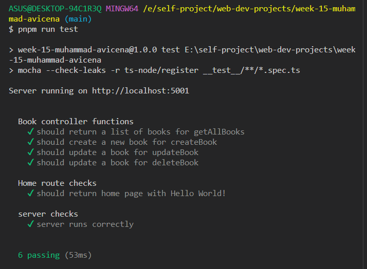
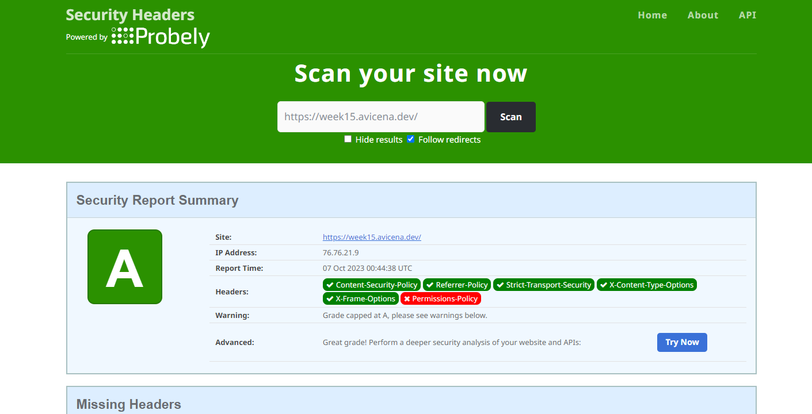

[](https://avicena.dev/)

<h1 align="center">Fancy to see you here  </h1>

hi, I'm Muhammad Avicena. In this repo, I build app that is designed to test CORS, protect against Clickjacking, and prevent XSS attacks.

I am committed to staying up-to-date with industry trends and using the latest tools to develop innovative solutions that surpass expectations.
Interested to have collaboration ? Find me on:

[](https://www.linkedin.com/in/muhammad-avicena/)
[](https://www.youtube.com/@MuhammadAvicena)
[](https://www.instagram.com/ryuhideaki.dev/)
[](mailto:cenarahmant.dev@gmail.com)

## INGREDIENTS I USE 📜

- React, Node, Express
- TypeScript
- MongoDB
- Unit test by Jest, Mocha & Supertest
- External/Internal Source:
  - SweetAlert2 for alert
  - MUI

## HOW TO USE 🌟

```bash
# Clone this repository
git clone https://github.com/muhammad-avicena/react-prevent-attacks.git

# Change directory
cd react-prevent-attacks

# Intall dependancy
pnpm install | npm install | yarn install

# Run the project
pnpm run dev | npm run dev | yarn run dev
```

## TESTING CHECK 🚧



## SECURITY CHECK 🚨



## DEPLOYMENT ⚙️

The project has been successfully deployed using Vercel. You can access the production version of the website by following this link: [https://week15.avicena.dev](https://week15.avicena.dev)

Back end Github: [https://github.com/muhammad-avicena/react-prevent-attacks](https://github.com/muhammad-avicena/react-prevent-attacks)

Feel free to explore the website and try out the different features. I appreciate any feedback and suggestions to further improve the user experience.
